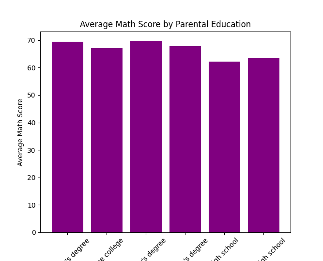
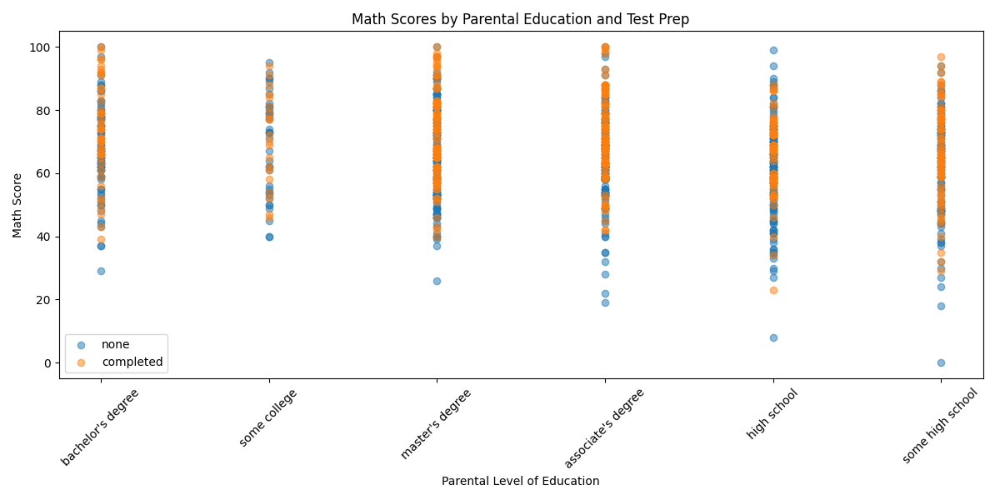

# Student Performance Regression

A Python project predicting student math scores using test preparation and parental education with real Kaggle data.

- **Author**: mikelikejordan
- **Dataset**: Students Performance in Exams (Kaggle: https://www.kaggle.com/datasets/spscientist/students-performance-in-exams)
- **Tools**: Python, Pandas, scikit-learn, Matplotlib
- **Insights**: Test prep boosts scores by ~5.53 points; parental education adds up to 3.23 points for master's degree.
- **Blog Post**: [Link to your blog post once published]

## Project Overview
This project analyzes how test preparation and parental education impact math scores using linear regression. Visualizations (bar and scatter plots) highlight trends, offering actionable insights for edutech applications. Developed as part of my journey from educator to machine learning enthusiast.

## Files
- `stud_perf_regress_proj_refined.py`: Main script with data loading, modeling, and visualizations.
- Dataset available on Kaggle (see link above).

## Visualizations

## How to Run
1. Clone the repo: `git clone https://github.com/mikelikejordan/student-performance-regression.git`
2. Download the dataset from Kaggle and place it in the project directory as `StudentsPerformance.csv`. Ensure the file name matches exactly as the script expects this specific name.
3. Install dependencies: `pip install pandas scikit-learn matplotlib`
4. Run the script: `python stud_perf_regress_proj.py`

## Future Work
Explore additional features like race/ethnicity to deepen the analysis.
